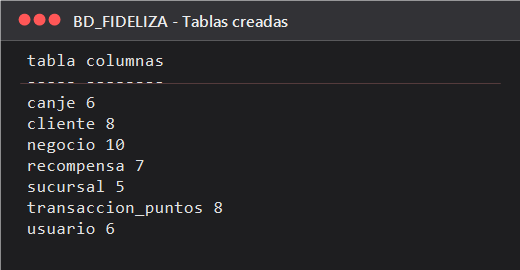
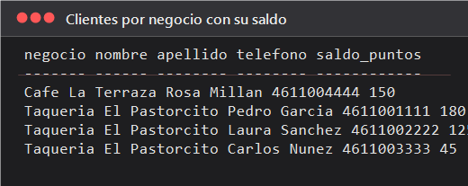
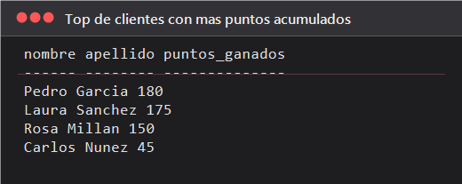
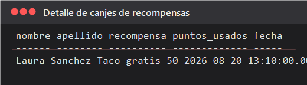
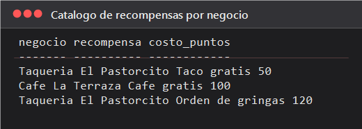

# Investigación de Empresa · Fideliza

## Descripción

Investigación de empresa para generar una base de datos.

- [x] a. Nombre de la empresa.
- [x] b. Giro de la empresa.
- [x] c. Descripción de la problemática. Tipo de empresa (micro, mediana y grande)
- [x] d. Cantidad de empleados.
- [x] e. Descripción de la infraestructura computacional.
- [x] f. Descripción de la infraestructura de red (internet)
- [x] g. Una aproximación de la cantidad de datos que maneja.
- [x] h. Diagrama entidad relación.
- [x] i. Diagrama relacional. Tablas que se generarán al realizar la base de datos.
- [x] j. Diccionario de datos.

## a. Nombre de la empresa

**Fideliza** — plataforma desarrollada por **Digitalandia**.

- Sitio: https://fideliza.desarrollo.castdevj.lat/
- Correo: Fideliza@digitalandia.com
- WhatsApp: +52 461 342 1141
- Ubicación: Celaya, Guanajuato, México.

## b. Giro de la empresa

Empresa de **servicios de software** (desarrollo de aplicaciones web). Su producto Fideliza es un **sistema de fidelización de clientes**: un programa de lealtad que cualquier negocio puede implementar para premiar a sus clientes con puntos y recompensas. Sirve para cualquier giro del cliente: restaurantes, tiendas, servicios, gimnasios, talleres, etc.

## c. Descripción de la problemática / tipo de empresa

**Tipo de empresa:** Micro (equipo pequeño de desarrollo, operación local en Celaya, Gto.).

**Problemática que resuelve:** los negocios pequeños y medianos no cuentan con un sistema accesible para retener clientes. Fideliza permite:

1. Registrar clientes por **número telefónico**.
2. Otorgar **puntos** según la regla definida por el negocio (ej. 1 punto por cada $1 de compra).
3. Gestionar **recompensas** y el saldo de puntos de cada cliente.
4. **Canjear** recompensas descontando el saldo correspondiente.

El sistema es genérico, se adapta al giro del negocio y queda bajo el control total del negocio cliente de la plataforma.

## d. Cantidad de empleados

Digitalandia opera como **estudio pequeño de desarrollo** (empresa micro, típicamente entre 2 y 10 personas). La base de datos modela al negocio que usa Fideliza, por lo que un caso típico de **cliente del sistema** es un negocio micro/mediano (restaurante, tienda o servicio) con 5 a 15 empleados.

## e. Descripción de la infraestructura computacional

- Aplicación web (SPA) accesible desde navegador (`/dashboard` y `/portal`).
- Portal de negocio y portal del cliente.
- En la **demostración** los datos se guardan **localmente en el navegador** (localStorage).
- En una implementación real, el negocio decide dónde y cómo almacenar los datos. Para esta actividad se propone **SQL Server 2022 en Docker**.
- Desarrollo y código del proyecto en **GitHub** (https://github.com/Digitalandia-dev).

## f. Descripción de la infraestructura de red (internet)

- Plataforma publicada como aplicación web bajo el dominio `fideliza.desarrollo.castdevj.lat`, protegida por un CDN/Red de entrega de contenido (Cloudflare `cdn-cgi`).
- Conexión **HTTPS** para los portales y formularios de contacto.
- Medios de contacto: WhatsApp, correo electrónico y redes sociales (Instagram, TikTok, Facebook, GitHub).
- Para el desarrollo de la base de datos se usa el servidor local `localhost,1434` levantado con Docker (ver `docker-compose.yml`).

## g. Aproximación de la cantidad de datos que maneja

El volumen es bajo en esta etapa de **demonstración** (decenas de registros en el navegador). Al escalar a implementaciones reales por negocio, se pueden proyectar, por negocio y por año:

| Concepto               | Estimación              |
| ---------------------- | ----------------------- |
| Clientes registrados   | 100 a 300 por negocio   |
| Transacciones de puntos| 2,000 a 10,000 / año    |
| Recompensas catálogo   | 10 a 30 por negocio     |
| Sucursales             | 1 a 3 por negocio       |
| Usuarios operadores    | 3 a 10 por negocio      |

## h. Diagrama entidad relación

![[Pasted image 20260905141450.png]]

Cardinalidades:

- Un **negocio** tiene muchas **sucursales**, **usuarios**, **clientes** y **recompensas** (1:N).
- Un **cliente** tiene muchas **transacciones_puntos** (1:N).
- Una **transacción** de tipo `CANJE` genera un **canje** de una **recompensa** (1:1 transaccion-canje, N:1 recompensa).

## i. Diagrama relacional

Tablas que se generan en la base de datos **BD_FIDELIZA** (script completo en [`bd_fideliza.sql`](bd_fideliza.sql)):

1. `negocio` — empresa que implementa el programa de fidelización.
2. `sucursal` — puntos de venta del negocio.
3. `usuario` — personal autorizado que opera la plataforma.
4. `cliente` — clientes registrados por teléfono con su saldo de puntos.
5. `recompensa` — catálogo de premios definido por el negocio.
6. `transaccion_puntos` — movimientos de acumulación y canje de puntos.
7. `canje` — detalle de cada canje de recompensa.

## j. Diccionario de datos

| Tabla | Columna | Tipo | Nulo | Descripcion |
|-------|---------|------|------|-------------|
| negocio | id_negocio | INT IDENTITY (PK) | No | Clave del negocio |
| negocio | nombre | VARCHAR(60) | No | Nombre comercial |
| negocio | giro | VARCHAR(60) | No | Giro del negocio |
| negocio | tipo_empresa | VARCHAR(20) | No | micro / mediana / grande |
| negocio | telefono | VARCHAR(20) | Si | Telefono de contacto |
| negocio | correo | VARCHAR(60) | Si | Correo de contacto |
| negocio | direccion | VARCHAR(120) | Si | Direccion |
| negocio | ciudad | VARCHAR(60) | Si | Ciudad y estado |
| negocio | regla_puntos | VARCHAR(200) | Si | Regla para otorgar puntos |
| negocio | fecha_registro | DATE | Si | Alta en la plataforma |
| sucursal | id_sucursal | INT IDENTITY (PK) | No | Clave de la sucursal |
| sucursal | id_negocio | INT (FK) | No | Negocio al que pertenece |
| sucursal | nombre | VARCHAR(60) | No | Nombre de la sucursal |
| sucursal | direccion | VARCHAR(120) | Si | Direccion |
| sucursal | telefono | VARCHAR(20) | Si | Telefono |
| usuario | id_usuario | INT IDENTITY (PK) | No | Clave del usuario |
| usuario | id_negocio | INT (FK) | No | Negocio al que pertenece |
| usuario | nombre | VARCHAR(60) | No | Nombre del operador |
| usuario | correo | VARCHAR(60) | Si | Correo de acceso |
| usuario | contrasena | VARCHAR(100) | Si | Hash de la contrasena |
| usuario | rol | VARCHAR(20) | No | Administrador / Cajero / Gerente |
| cliente | id_cliente | INT IDENTITY (PK) | No | Clave del cliente |
| cliente | id_negocio | INT (FK) | No | Negocio al que pertenece |
| cliente | telefono | VARCHAR(20) | No (UQ) | Identificador del cliente |
| cliente | nombre | VARCHAR(40) | Si | Nombre |
| cliente | apellido | VARCHAR(40) | Si | Apellido |
| cliente | correo | VARCHAR(60) | Si | Correo |
| cliente | saldo_puntos | INT | No | Saldo actual de puntos |
| cliente | fecha_registro | DATE | Si | Alta en el programa |
| recompensa | id_recompensa | INT IDENTITY (PK) | No | Clave de la recompensa |
| recompensa | id_negocio | INT (FK) | No | Negocio dueno |
| recompensa | nombre | VARCHAR(60) | No | Nombre del premio |
| recompensa | descripcion | VARCHAR(200) | Si | Detalle del premio |
| recompensa | costo_puntos | INT | No | Puntos requeridos |
| recompensa | fecha_inicio | DATE | Si | Vigencia inicial |
| recompensa | fecha_fin | DATE | Si | Fin de vigencia |
| transaccion_puntos | id_transaccion | INT IDENTITY (PK) | No | Clave del movimiento |
| transaccion_puntos | id_cliente | INT (FK) | No | Cliente que acumula/canjea |
| transaccion_puntos | id_sucursal | INT (FK) | Si | Sucursal donde ocurrio |
| transaccion_puntos | id_usuario | INT (FK) | Si | Operador que registro |
| transaccion_puntos | tipo | VARCHAR(15) | No | ACUMULACION / CANJE |
| transaccion_puntos | puntos | INT | No | Puntos (+ o -) |
| transaccion_puntos | monto_compra | FLOAT | Si | Monto de la compra |
| transaccion_puntos | fecha | DATETIME | Si | Fecha y hora |
| canje | id_canje | INT IDENTITY (PK) | No | Clave del canje |
| canje | id_transaccion | INT (FK) | No | Movimiento que lo origina |
| canje | id_recompensa | INT (FK) | No | Recompensa canjeada |
| canje | id_cliente | INT (FK) | No | Cliente beneficiario |
| canje | puntos_usados | INT | No | Puntos descontados |
| canje | fecha | DATETIME | Si | Fecha del canje |

Resumen por tabla:

- **negocio**: empresa que implementa el programa de fidelizacion. Guarda giro, tipo, regla de puntos y datos de contacto. Es la raiz del modelo: todo lo demas depende de ella.
- **sucursal**: puntos de venta del negocio (matriz y sucursales). Permite saber en que lugar se hizo cada compra o canje.
- **usuario**: personal autorizado que opera el portal del negocio. El rol define el nivel (administrador, cajero) y la contrasena se almacena como hash.
- **cliente**: persona registrada por su numero telefonico. `telefono` es unico y es la llave de identificacion que usa Fideliza. `saldo_puntos` es el saldo utilizable.
- **recompensa**: catalogo de premios definido por el negocio con su costo en puntos y vigencia.
- **transaccion_puntos**: bitacora de movimientos. Registra `ACUMULACION` (puntos positivos) o `CANJE` (puntos negativos), el monto de compra, la sucursal y el operador.
- **canje**: detalle de cada canje, vincula la transaccion con la recompensa entregada y los puntos utilizados.

## Capturas de la base de datos

Servidor levantado con `docker-compose up -d` (contenedor `sqlserver-fideliza`), base `BD_FIDELIZA` creada desde [`bd_fideliza.sql`](bd_fideliza.sql).

```
Server: localhost,1434
User: sa
Password: YourStrong@Password123
```

| Captura                                          | Descripcion                                 |
| ------------------------------------------------ | ------------------------------------------- |
|                  | Tablas creadas en `BD_FIDELIZA`             |
|   | Clientes por negocio con su saldo de puntos |
|      | Top de clientes con mas puntos acumulados   |
|  | Detalle de canjes de recompensas            |
|        | Catalogo de recompensas por negocio         |

---

## Entregable

**URL del documento:** https://docs.google.com/document/d/1GjExAf6t-bJcW0bAwtX6VKnyY6mB9MmeNJ_2PfYuSKQ/edit?usp=sharing

## Fecha límite

Antes del **9 de septiembre de 2026** (subir a CONACAD en tiempo y forma).